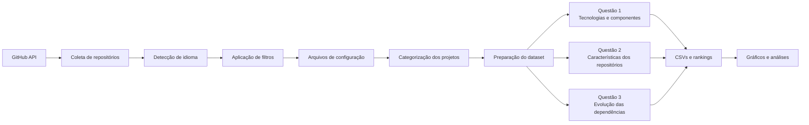
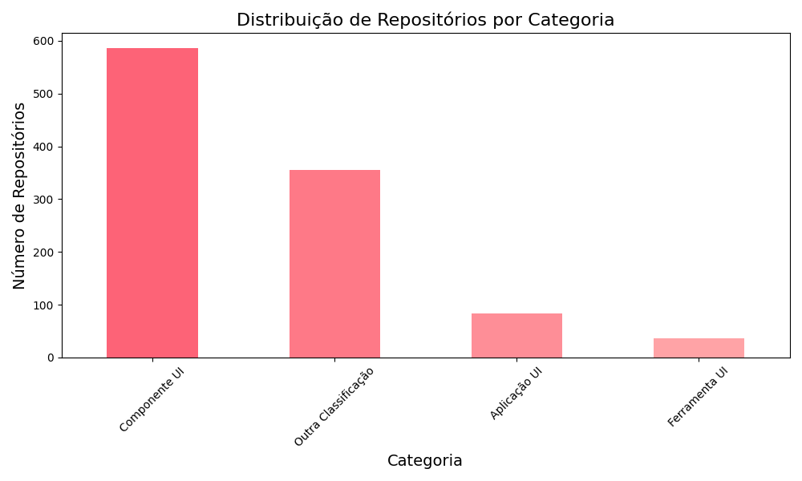
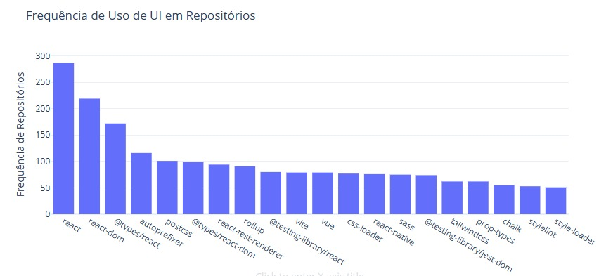

<div align="center">

# Mineração de Repositórios com Foco em UI/UX

**Uma pipeline acadêmica para coletar, filtrar e analisar repositórios open source e investigar tecnologias, componentes e evolução de dependências relacionadas a interfaces de usuário.**


</div>

---

## Sobre o projeto

Este repositório reúne o processo de **mineração de repositórios de software** desenvolvido para investigar práticas, tecnologias e dependências associadas a **UI/UX** em projetos open source hospedados no GitHub.

O trabalho foi desenvolvido no contexto da disciplina **Tópicos em Engenharia de Sistemas de Software 1**, do Programa de Pós-Graduação em Ciência da Computação da **Universidade Estadual de Maringá (UEM)**.

A análise combina:

- coleta de metadados pela API do GitHub;
- filtragem e preparação do dataset;
- detecção de idioma;
- identificação de arquivos de configuração;
- categorização de repositórios;
- extração e ranking de dependências;
- cruzamento de métricas dos projetos;
- mineração do histórico de alterações;
- geração de tabelas e visualizações.

> O repositório representa um **snapshot de pesquisa**. Os resultados refletem o período e os critérios de coleta registrados nos notebooks e datasets, e não necessariamente o estado atual do ecossistema GitHub.

---

## Visão geral da pipeline



---

## Estrutura do repositório

```text
.
├── Code/
│   ├── 01-pesquisa.ipynb
│   ├── 02-detectar-idioma.ipynb
│   ├── 03-filtros-aplicados.ipynb
│   ├── 04-filtros-por-arquivo-config.ipynb
│   ├── 05-categorizar-repositórios.ipynb
│   ├── 06-formatar-data.ipynb
│   ├── 07-primeiras-analises.ipynb
│   ├── 08-busca-pelo-arquivos-config.ipynb
│   ├── 09-separar-dataset.ipynb
│   ├── 10-ranking.ipynb
│   ├── 11-repositorios-frequencia.ipynb
│   ├── 12-tratamentos-dados.ipynb
│   ├── 13-historico-repositorios.ipynb
│   └── 14-analise-dependencies.ipynb
├── Database/
│   ├── Resultados-Busca/
│   ├── Questao1/
│   ├── Questao2/
│   └── Questao3/
├── Image/
│   ├── Resultados-Busca/
│   ├── Questao1/
│   ├── Questao2/
│   └── Questao3/
├── requirements.txt
├── .gitignore
└── README.md
```

---

## Notebooks e ordem de execução

### 1. Construção e preparação do dataset

| # | Notebook | Objetivo |
| ---: | --- | --- |
| 01 | [`01-pesquisa.ipynb`](Code/01-pesquisa.ipynb) | Busca inicial de repositórios no GitHub a partir dos critérios da pesquisa. |
| 02 | [`02-detectar-idioma.ipynb`](Code/02-detectar-idioma.ipynb) | Detecta o idioma e auxilia na seleção dos repositórios em inglês. |
| 03 | [`03-filtros-aplicados.ipynb`](Code/03-filtros-aplicados.ipynb) | Aplica filtros adicionais ao conjunto coletado. |
| 04 | [`04-filtros-por-arquivo-config.ipynb`](Code/04-filtros-por-arquivo-config.ipynb) | Identifica arquivos de configuração relevantes, como `package.json`, `composer.json`, `angular.json` e `tsconfig.json`. |
| 05 | [`05-categorizar-repositórios.ipynb`](Code/05-categorizar-repositórios.ipynb) | Categoriza os repositórios conforme o papel relacionado a UI/UX. |
| 06 | [`06-formatar-data.ipynb`](Code/06-formatar-data.ipynb) | Normaliza e prepara informações temporais do dataset. |
| 07 | [`07-primeiras-analises.ipynb`](Code/07-primeiras-analises.ipynb) | Produz as primeiras análises descritivas e visualizações. |

### 2. Questão de pesquisa 1 — tecnologias e componentes

| # | Notebook | Objetivo |
| ---: | --- | --- |
| 08 | [`08-busca-pelo-arquivos-config.ipynb`](Code/08-busca-pelo-arquivos-config.ipynb) | Obtém o conteúdo dos arquivos de configuração dos repositórios selecionados. |
| 09 | [`09-separar-dataset.ipynb`](Code/09-separar-dataset.ipynb) | Separa os dados por tipo de arquivo de configuração. |
| 10 | [`10-ranking.ipynb`](Code/10-ranking.ipynb) | Conta dependências e gera rankings por tipo de configuração. |
| 11 | [`11-repositorios-frequencia.ipynb`](Code/11-repositorios-frequencia.ipynb) | Consolida e apresenta a frequência dos componentes classificados como relacionados a UI/UX. |

### 3. Questão de pesquisa 2 — cruzamento de características

| # | Notebook | Objetivo |
| ---: | --- | --- |
| 12 | [`12-tratamentos-dados.ipynb`](Code/12-tratamentos-dados.ipynb) | Extrai plugins, combina os dados de dependências com os metadados dos repositórios e gera análises comparativas. |

### 4. Questão de pesquisa 3 — evolução histórica

| # | Notebook | Objetivo |
| ---: | --- | --- |
| 13 | [`13-historico-repositorios.ipynb`](Code/13-historico-repositorios.ipynb) | Minera o histórico dos repositórios e registra alterações relevantes em arquivos de configuração. |
| 14 | [`14-analise-dependencies.ipynb`](Code/14-analise-dependencies.ipynb) | Analisa a evolução de `dependencies` e `devDependencies` ao longo do tempo e dos commits. |

---

## Exemplos de resultados

Os notebooks geram arquivos intermediários em `Database/` e visualizações em `Image/`.

### Distribuição dos repositórios por categoria

<p align="center">
  
</p>

### Comparação produzida na Questão 1

<p align="center">
  
</p>

Outros resultados da análise histórica estão disponíveis em [`Image/Questao3/`](Image/Questao3/).

---

## Como executar

### 1. Clone o repositório

```bash
git clone https://github.com/MatheusRodrigues-Dev/Mineracao-Repositorio-Foco-UI.git
cd Mineracao-Repositorio-Foco-UI
```

### 2. Crie um ambiente virtual

```bash
python -m venv .venv
```

**Windows**

```bash
.venv\Scripts\activate
```

**Linux/macOS**

```bash
source .venv/bin/activate
```

### 3. Instale as dependências

```bash
pip install -r requirements.txt
```

### 4. Inicie o Jupyter

```bash
jupyter lab
```

Abra a pasta `Code/` e execute os notebooks na ordem apresentada acima quando quiser reconstruir a pipeline completa.

---

## Autenticação na API do GitHub

Alguns notebooks utilizam **PyGithub** para consultar a API do GitHub e precisam de um token pessoal.

Nos notebooks que possuem o placeholder:

```python
Github("SEU-TOKEN")
```

substitua `SEU-TOKEN` **somente no seu ambiente local**.

> **Nunca faça commit de tokens reais, senhas ou outras credenciais.** O arquivo `.gitignore` deste repositório também ignora arquivos `.env`, caso você utilize variáveis de ambiente em uma adaptação local.

A API do GitHub possui limites de requisição. A reconstrução completa do dataset, especialmente a mineração histórica, pode exigir muitas chamadas e levar um tempo considerável.

---

## Dependências principais

- **Pandas** — manipulação, limpeza e combinação dos datasets;
- **PyGithub** — acesso à API do GitHub;
- **langdetect** — detecção do idioma dos repositórios;
- **Matplotlib** — geração de gráficos;
- **Seaborn** — visualizações estatísticas;
- **JupyterLab** — execução interativa dos notebooks.

A lista para instalação está em [`requirements.txt`](requirements.txt).

---

## Dados e reprodutibilidade

A pasta `Database/` contém tanto resultados intermediários quanto conjuntos usados nas diferentes etapas da pesquisa. Alguns arquivos são grandes porque preservam dados coletados e históricos necessários às análises.

Ao reproduzir o estudo, considere que:

- consultas feitas hoje podem retornar resultados diferentes dos registrados originalmente;
- repositórios podem ter sido atualizados, renomeados, arquivados ou removidos;
- estrelas, forks, issues e dependências mudam ao longo do tempo;
- a classificação e alguns refinamentos possuem etapas de análise manual;
- limites da API podem interferir na execução em larga escala.

Esses fatores fazem parte das limitações naturais de estudos de **Mining Software Repositories (MSR)** baseados em dados vivos do GitHub.

---

## Tecnologias analisadas

A pipeline inspeciona, entre outros artefatos:

`package.json` · `composer.json` · `angular.json` · `tsconfig.json` · `babel.config.js` · `postcss.config.js` · `vue.config.js`

Esses arquivos ajudam a identificar frameworks, bibliotecas, ferramentas de build e componentes utilizados pelos projetos estudados.

---

## Contexto acadêmico

**Universidade Estadual de Maringá — UEM**  
Programa de Pós-Graduação em Ciência da Computação  
Disciplina: **Tópicos em Engenharia de Sistemas de Software 1**

O objetivo do projeto é apoiar a investigação de práticas e tecnologias relacionadas a interfaces por meio de técnicas de mineração de repositórios de software.

---

## Autor

**Matheus Rodrigues**

[GitHub](https://github.com/MatheusRodrigues-Dev)

> Projeto acadêmico voltado ao estudo de Engenharia de Software, Mineração de Repositórios e tecnologias de UI/UX.
